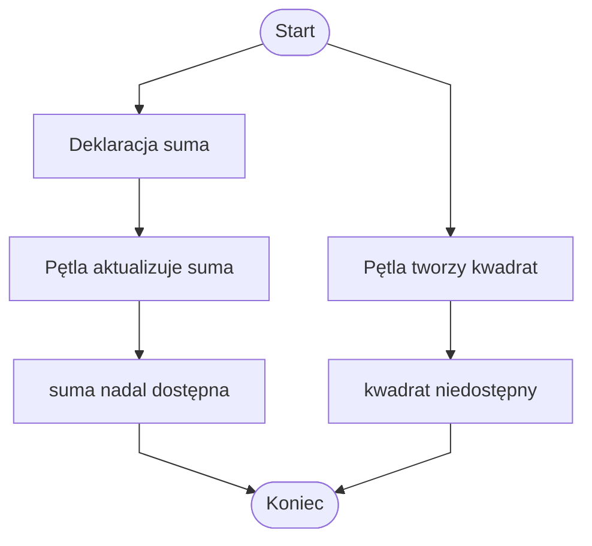

# Zmienne w pętlach

## Dlaczego zakres zmiennych w pętli jest ważny

W pętlach często używamy kilku rodzajów zmiennych:

* licznika pętli,
* akumulatora,
* licznika elementów spełniających warunek,
* zmiennych pomocniczych tworzonych wewnątrz pętli.

Miejsce deklaracji zmiennej decyduje o tym, gdzie można jej używać. Niektóre zmienne są potrzebne tylko w pętli, a inne muszą być dostępne także po jej zakończeniu.

## Licznik pętli for

```csharp
using System;

class Program
{
    static void Main()
    {
        for (int i = 0; i < 5; i++)
        {
            Console.WriteLine(i);
        }
    }
}
```

W tym przykładzie:

* `i` jest licznikiem pętli,
* `i` jest zadeklarowane w nagłówku pętli `for`,
* `i` jest dostępne w warunku, w kroku pętli i w ciele pętli,
* po zakończeniu pętli `i` zwykle nie jest dostępne.

Przykład błędny:

```csharp
using System;

class Program
{
    static void Main()
    {
        for (int i = 0; i < 5; i++)
        {
            Console.WriteLine(i);
        }

        Console.WriteLine(i);
    }
}
```

To jest błąd, ponieważ `i` nie istnieje poza pętlą `for`.

## Zmienna pomocnicza wewnątrz pętli

```csharp
using System;

class Program
{
    static void Main()
    {
        for (int i = 1; i <= 5; i++)
        {
            int kwadrat = i * i;
            Console.WriteLine(kwadrat);
        }
    }
}
```

W tym przykładzie:

* `kwadrat` powstaje wewnątrz bloku pętli,
* można go używać tylko w tym bloku,
* w każdej iteracji tworzona jest nowa wartość pomocnicza,
* po wyjściu z bloku pętli `kwadrat` nie jest dostępny.

## Akumulator przed pętlą

Akumulator musi istnieć przed pętlą, jeżeli chcemy go aktualizować w kolejnych iteracjach i użyć po zakończeniu pętli.

```csharp
using System;

class Program
{
    static void Main()
    {
        int suma = 0;

        for (int i = 1; i <= 5; i++)
        {
            suma += i;
        }

        Console.WriteLine(suma);
    }
}
```

W tym przykładzie:

* `suma` jest zadeklarowana przed pętlą,
* w pętli jest aktualizowana,
* po pętli można wypisać jej końcową wartość.

## Diagram: zmienna w pętli a zmienna przed pętlą



Diagram pokazuje różnicę między zmienną zadeklarowaną przed pętlą a zmienną zadeklarowaną w bloku pętli. `suma` jest dostępna po pętli, a `kwadrat` nie.

## Licznik spełnionych warunków

```csharp
using System;

class Program
{
    static void Main()
    {
        int[] liczby = { 3, 8, 12, 5, 10 };
        int licznik = 0;

        foreach (int liczba in liczby)
        {
            if (liczba > 7)
            {
                licznik++;
            }
        }

        Console.WriteLine(licznik);
    }
}
```

W tym przykładzie:

* `licznik` musi być zadeklarowany przed pętlą,
* pętla zwiększa `licznik` tylko wtedy, gdy warunek jest spełniony,
* po zakończeniu pętli `licznik` zawiera wynik.

## Błąd: akumulator zadeklarowany w pętli

Przykład błędny:

```csharp
using System;

class Program
{
    static void Main()
    {
        for (int i = 1; i <= 5; i++)
        {
            int suma = 0;
            suma += i;
        }

        Console.WriteLine(suma);
    }
}
```

Ten program zawiera błąd:

* `suma` została zadeklarowana wewnątrz pętli,
* poza pętlą nie jest dostępna,
* dodatkowo w każdej iteracji zaczynałaby od `0`,
* dlatego akumulator deklarujemy przed pętlą.

Poprawna wersja:

```csharp
using System;

class Program
{
    static void Main()
    {
        int suma = 0;

        for (int i = 1; i <= 5; i++)
        {
            suma += i;
        }

        Console.WriteLine(suma);
    }
}
```

## Zmienna w pętli while

```csharp
using System;

class Program
{
    static void Main()
    {
        int i = 0;

        while (i < 5)
        {
            Console.WriteLine(i);
            i++;
        }
    }
}
```

Przy pętli `while` licznik często deklaruje się przed pętlą, ponieważ warunek pętli musi go znać.

## Najczęstsze błędy

* Użycie licznika `for` po zakończeniu pętli.
* Deklarowanie akumulatora wewnątrz pętli.
* Zerowanie akumulatora w każdej iteracji.
* Użycie zmiennej pomocniczej poza blokiem pętli.
* Brak aktualizacji licznika w `while`.
* Mylenie licznika pętli z licznikiem spełnionych warunków.

## Ćwiczenia

1. Napisz pętlę `for`, która wypisuje liczby od `0` do `4`. Wskaż, gdzie istnieje zmienna `i`.
2. Sprawdź, co się stanie, gdy spróbujesz wypisać `i` po zakończeniu pętli `for`.
3. Napisz pętlę, w której wewnątrz bloku tworzona jest zmienna `kwadrat`.
4. Napisz program, który sumuje liczby od `1` do `10`, używając akumulatora `suma`.
5. Popraw program, w którym `suma` jest deklarowana wewnątrz pętli.
6. Napisz program, który liczy, ile elementów tablicy jest większych od `10`.
7. Napisz program z `while`, w którym licznik jest zadeklarowany przed pętlą.
8. Wskaż, które zmienne powinny być zadeklarowane przed pętlą, a które wewnątrz pętli.

## Podsumowanie

Licznik `for` zwykle istnieje tylko w pętli.

Zmienna pomocnicza zadeklarowana w bloku pętli nie jest dostępna poza tym blokiem.

Akumulator powinien być zadeklarowany przed pętlą. Licznik spełnionych warunków także zwykle deklarujemy przed pętlą.

Miejsce deklaracji zmiennej decyduje o tym, gdzie można jej używać.
