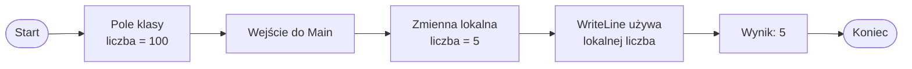

# Przesłanianie zmiennych

## O co chodzi z nazwami

Każda zmienna ma nazwę. Nazwa pozwala odwołać się do konkretnej wartości zapisanej w programie.

Zakres zmiennej decyduje o tym, gdzie dana nazwa jest widoczna. Ta sama nazwa może pojawić się w różnych miejscach programu, ale nie zawsze oznacza to tę samą zmienną.

## Czym jest przesłanianie

Przesłanianie nazwy oznacza sytuację, w której w bliższym zakresie pojawia się nazwa taka sama jak nazwa istniejąca w dalszym zakresie. Wtedy bliższa nazwa może zasłonić dalszą.

Na tym etapie traktujemy to jako temat ostrzegawczy. Lepiej pisać kod tak, aby nie mylić nazw i nie zmuszać czytelnika do zgadywania, o którą zmienną chodzi.

## Przykład: pole klasy i zmienna lokalna

```csharp
using System;

class Program
{
    static int liczba = 100;

    static void Main()
    {
        int liczba = 5;

        Console.WriteLine(liczba);
    }
}
```

W tym przykładzie:

* `static int liczba = 100;` jest polem klasy `Program`,
* `int liczba = 5;` jest zmienną lokalną metody `Main`,
* w `Main` nazwa `liczba` odnosi się do zmiennej lokalnej,
* lokalna zmienna przesłania pole klasy o tej samej nazwie,
* program wypisze `5`.

Pola klasy będą dokładniej omawiane w dziale o obiektach. Tutaj przykład służy tylko do pokazania zjawiska przesłaniania.

## Diagram: która nazwa jest bliżej



Diagram pokazuje, że w metodzie `Main` bliżej jest zmienna lokalna `liczba`, dlatego to jej wartość zostanie wypisana.

## Dlaczego to może być mylące

Taki kod jest legalny, ale może być nieczytelny. Osoba czytająca program musi sprawdzić, czy `liczba` oznacza pole klasy, czy zmienną lokalną.

Lepsza wersja:

```csharp
using System;

class Program
{
    static int domyslnaLiczba = 100;

    static void Main()
    {
        int aktualnaLiczba = 5;

        Console.WriteLine(aktualnaLiczba);
    }
}
```

Różne nazwy lepiej pokazują sens danych. `domyslnaLiczba` i `aktualnaLiczba` nie wyglądają jak przypadkowo powtórzona ta sama nazwa.

## C# nie pozwala na wszystko

Nie należy zakładać, że w każdym zagnieżdżonym bloku można utworzyć zmienną o tej samej nazwie. C# chroni przed częścią takich pomyłek.

Przykład błędny:

```csharp
using System;

class Program
{
    static void Main()
    {
        int liczba = 10;

        if (liczba > 0)
        {
            int liczba = 5;
            Console.WriteLine(liczba);
        }
    }
}
```

W C# taka ponowna deklaracja zmiennej lokalnej o tej samej nazwie w nachodzącym zakresie jest błędem kompilacji.

Kompilator nie pozwala w tym miejscu utworzyć drugiej lokalnej zmiennej `liczba`, ponieważ mogłoby to prowadzić do niejasności.

## Parametr i zmienna lokalna o tej samej nazwie

Przykład błędny:

```csharp
using System;

class Program
{
    static void PokazLiczbe(int liczba)
    {
        int liczba = 5;
        Console.WriteLine(liczba);
    }

    static void Main()
    {
        PokazLiczbe(10);
    }
}
```

Parametr `liczba` już istnieje w zakresie metody `PokazLiczbe`, więc nie można w tej samej metodzie zadeklarować drugiej zmiennej lokalnej o tej samej nazwie.

Poprawna wersja:

```csharp
using System;

class Program
{
    static void PokazLiczbe(int liczba)
    {
        int podwojona = liczba * 2;
        Console.WriteLine(podwojona);
    }

    static void Main()
    {
        PokazLiczbe(10);
    }
}
```

Nazwa `podwojona` jasno mówi, że zmienna przechowuje wartość obliczoną na podstawie parametru.

## Dobre praktyki

* Nie używaj tej samej nazwy dla różnych rzeczy, jeśli nie musisz.
* Wybieraj nazwy opisujące rolę zmiennej.
* Unikaj nazw typu `x`, `y`, `temp`, jeśli nie wiadomo, co oznaczają.
* Dla pola klasy i zmiennej lokalnej używaj nazw pokazujących różnicę znaczenia.
* Jeżeli kod zaczyna wymagać tłumaczenia, nazwy prawdopodobnie są za słabe.

## Najczęstsze błędy

* Przekonanie, że taka sama nazwa zawsze oznacza tę samą zmienną.
* Próba ponownej deklaracji zmiennej lokalnej o tej samej nazwie.
* Mylenie pola klasy ze zmienną lokalną.
* Nadawanie parametrowi i zmiennej lokalnej tej samej nazwy.
* Używanie zbyt ogólnych nazw.

## Ćwiczenia

1. Wskaż, która zmienna zostanie użyta w przykładzie z polem klasy `liczba` i zmienną lokalną `liczba`.
2. Zmień nazwy w przykładzie tak, aby kod był czytelniejszy.
3. Sprawdź, czy C# pozwoli zadeklarować zmienną lokalną o tej samej nazwie w bloku `if`.
4. Popraw błędny kod, w którym parametr i zmienna lokalna mają tę samą nazwę.
5. Podaj lepsze nazwy dla zmiennych `x`, `y` i `temp` w krótkim programie sumującym liczby.
6. Wyjaśnij własnymi słowami, dlaczego przesłanianie może utrudniać czytanie programu.
7. Napisz krótki program, w którym nazwy zmiennych jasno pokazują ich przeznaczenie.

## Podsumowanie

Przesłanianie oznacza zasłonięcie nazwy z dalszego zakresu przez nazwę z bliższego zakresu.

C# nie pozwala na każdą ponowną deklarację tej samej nazwy. Pole klasy może zostać przesłonięte przez zmienną lokalną, ale zmienna lokalna nie zawsze może zostać ponownie zadeklarowana w zagnieżdżonym bloku.

Taka sama nazwa nie zawsze oznacza tę samą rzecz. Początkujący programista powinien raczej unikać przesłaniania i wybierać czytelne nazwy.
