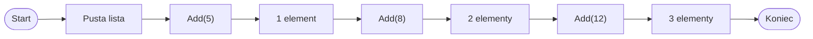

# List<int>

## Po co jest List<int>

Tablica ma stały rozmiar, a lista może rosnąć w trakcie działania programu.

```csharp
int[] liczby = new int[3];
```

W tym przykładzie tablica ma miejsce na `3` liczby.

```csharp
List<int> liczby = new List<int>();
```

W tym przykładzie tworzymy pustą listę liczb całkowitych. Do listy można później dodawać kolejne liczby.

Najważniejsze różnice:

- tablica ma z góry ustaloną liczbę elementów,
- do `List<int>` można dodawać kolejne liczby,
- `List<int>` jest wygodna, gdy nie wiemy od razu, ile elementów będzie potrzebnych.

## Potrzebny using

Aby używać `List<T>`, trzeba dodać:

```csharp
using System.Collections.Generic;
```

Minimalny szkielet programu:

```csharp
using System;
using System.Collections.Generic;

class Program
{
    static void Main()
    {
        List<int> liczby = new List<int>();
    }
}
```

`List<int>` oznacza listę przechowującą liczby całkowite.

## Utworzenie listy i dodawanie elementów

```csharp
using System;
using System.Collections.Generic;

class Program
{
    static void Main()
    {
        List<int> liczby = new List<int>();

        liczby.Add(5);
        liczby.Add(8);
        liczby.Add(12);

        Console.WriteLine(liczby.Count);
    }
}
```

Wyjaśnienie:

- `Add` dodaje nowy element na koniec listy,
- `Count` zwraca liczbę elementów listy.

Program wypisze `3`, ponieważ do listy dodano trzy liczby.

## Diagram: lista rośnie



Lista może rosnąć po dodaniu kolejnych elementów.

## Odczyt elementu przez indeks

```csharp
Console.WriteLine(liczby[0]);
Console.WriteLine(liczby[1]);
```

Wyjaśnienie:

- indeksy zaczynają się od `0`,
- `liczby[0]` oznacza pierwszy element,
- `liczby[1]` oznacza drugi element,
- tak jak w tablicach, wyjście poza zakres jest błędem.

## Przejście po liście pętlą for

```csharp
for (int i = 0; i < liczby.Count; i++)
{
    Console.WriteLine(liczby[i]);
}
```

W liście używamy `Count`, a w tablicy używamy `Length`.

Pętla `for` jest dobra, gdy potrzebujemy indeksu elementu.

## Przejście po liście pętlą foreach

```csharp
foreach (int liczba in liczby)
{
    Console.WriteLine(liczba);
}
```

Pętla `foreach` jest wygodna, gdy chcemy przejść po wszystkich elementach i nie potrzebujemy indeksu.

## Usuwanie elementów

```csharp
liczby.Remove(8);
```

`Remove` usuwa pierwsze wystąpienie konkretnej wartości.

```csharp
liczby.RemoveAt(0);
```

`RemoveAt` usuwa element z podanego indeksu.

Po usunięciu elementu lista ma mniejszy `Count`.

## Sprawdzenie, czy lista zawiera element

```csharp
if (liczby.Contains(12))
{
    Console.WriteLine("Lista zawiera 12");
}
```

`Contains` zwraca `true` albo `false`. Dzięki temu można sprawdzić, czy na liście znajduje się wybrana wartość.

## Suma elementów listy

```csharp
using System;
using System.Collections.Generic;

class Program
{
    static void Main()
    {
        List<int> liczby = new List<int>();

        liczby.Add(5);
        liczby.Add(8);
        liczby.Add(12);

        int suma = 0;

        foreach (int liczba in liczby)
        {
            suma += liczba;
        }

        Console.WriteLine(suma);
    }
}
```

Sumowanie działa podobnie jak przy tablicy. Różnica polega na tym, że elementy przechowuje lista.

## Tablica a lista

| Cecha | `int[]` | `List<int>` |
|---|---|---|
| Rozmiar | Zwykle ustalony przy tworzeniu | Może rosnąć |
| Liczba elementów | `Length` | `Count` |
| Dodawanie elementu | Niewygodne | `Add` |
| Odczyt po indeksie | `liczby[0]` | `liczby[0]` |
| Dobre zastosowanie | Gdy znamy rozmiar | Gdy rozmiar może się zmieniać |

## Najczęstsze błędy

- Brak `using System.Collections.Generic`.
- Mylenie `Length` z `Count`.
- Próba odczytu elementu, którego nie ma.
- Pomylenie `Remove` z `RemoveAt`.
- Zapomnienie, że indeksy zaczynają się od `0`.
- Używanie `List<int>`, gdy zwykła tablica w prostym zadaniu wystarcza.

## Ćwiczenia

1. Utwórz pustą listę `List<int>`.
2. Dodaj do listy trzy liczby metodą `Add`.
3. Wypisz liczbę elementów listy za pomocą `Count`.
4. Wypisz pierwszy element listy.
5. Wypisz wszystkie elementy listy pętlą `for`.
6. Wypisz wszystkie elementy listy pętlą `foreach`.
7. Oblicz sumę elementów listy.
8. Sprawdź, czy lista zawiera wybraną liczbę za pomocą `Contains`.

## Podsumowanie

`List<int>` przechowuje liczby całkowite.

Lista może rosnąć w trakcie działania programu. `Add` dodaje element, a `Count` zwraca liczbę elementów.

Elementy listy można odczytywać przez indeks. Pętla `foreach` dobrze nadaje się do przechodzenia po wszystkich elementach.

`List<int>` jest wygodna, gdy liczba danych nie jest znana z góry.
